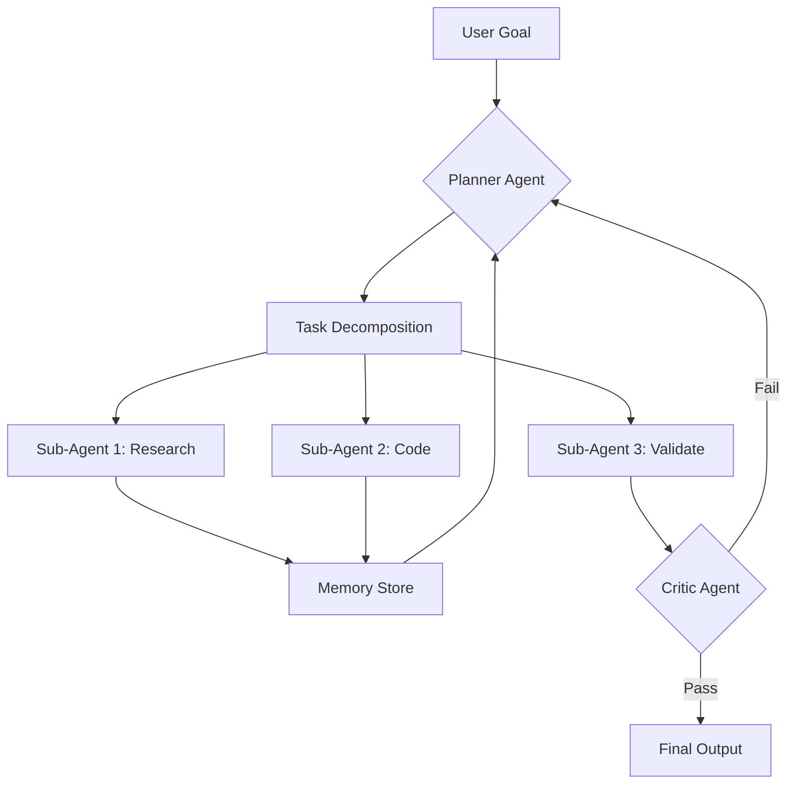

<div align="center">


</div>

<div align="center">

[](https://git.io/typing-svg)

</div>

<br/>

<div align="center">


[](https://github.com/GITHUB_USERNAME)

</div>

---

## 🧬 Kimim Ben?

```python
class AIArchitect:
    def __init__(self):
        self.name         = "Mete"
        self.title        = "AI Architect & Agent Engineer"
        self.company      = "Hexonithy Studios"
        self.location     = "Turkey 🇹🇷"
        self.philosophy   = "Don't just write code. Vibe with the AI and build ecosystems."

    @property
    def focus_areas(self) -> list[str]:
        return [
            "Autonomous AI Agent Design",
            "Multi-Agent Orchestration",
            "Model Context Protocol (MCP)",
            "LLM Fine-Tuning & RLHF",
            "Cybersecurity AI Agents",
            "Local LLM Optimization",
            "Agentic Workflow Architecture",
            "Vibe Coding Methodology",
        ]

    @property
    def current_projects(self) -> dict:
        return {
            "OpenClaw"      : "7/24 autonomous AI assistant on Ubuntu VDS",
            "HexonithyAI"   : "Next-gen autonomous workflow ecosystem",
            "CyberAgent"    : "Autonomous cybersecurity & threat detection agent",
            "LocalLLM Lab"  : "RTX 3060 Ti üzerinde GGUF fine-tuning pipeline",
        }

    def __repr__(self):
        return f"<{self.title} @ {self.company}>"
```

---

## 🏢 Hexonithy Studios

> **Hexonithy Studios**, yapay zeka odaklı otonom sistemler, ajan mimarileri ve ileri düzey LLM entegrasyonları üzerine kurulan bir yapay zeka stüdyosudur. Sektörde teknolojiyi satın almak yerine, bizzat inşa etmeyi tercih eden bir anlayışla kurulmuştur.

**Vizyon:** Kod yazan değil, *düşünen* ve *karar veren* sistemler üretmek.

**Misyon:** MCP standartlarında çalışan, birbirleriyle iletişim kurabilen, kendi kendini yöneten otonom ajan ekosistemlerini hayata geçirmek.

---

## 🤖 AI Agent Mimarileri

Bir otonom yapay zeka sistemi tasarlamak, tek bir model çalıştırmaktan çok daha karmaşıktır. Aşağıdaki katmanları tasarlıyor ve uyguluyorum:

### 🧠 Agent Tasarım Prensipleri

```
┌─────────────────────────────────────────────────────────┐
│                   AGENT ARCHITECTURE                    │
│                                                         │
│  ┌─────────┐    ┌──────────┐    ┌──────────────────┐   │
│  │ Planner │───▶│ Executor │───▶│   Tool Invoker   │   │
│  │  (LLM)  │    │  (Chain) │    │  (MCP / APIs)    │   │
│  └─────────┘    └──────────┘    └──────────────────┘   │
│       │                                  │              │
│       ▼                                  ▼              │
│  ┌─────────┐                    ┌──────────────────┐   │
│  │ Memory  │                    │    Feedback       │   │
│  │ (RAG /  │                    │    Loop &         │   │
│  │ Vector) │                    │    Self-Critique  │   │
│  └─────────┘                    └──────────────────┘   │
└─────────────────────────────────────────────────────────┘
```

### ⚙️ Multi-Agent Orchestration

| Katman | Açıklama | Kullandığım Teknoloji |
|--------|----------|-----------------------|
| **Orchestrator Agent** | Görevleri alt ajanlara dağıtır, önceliklendirir | Claude / GPT-4 Turbo |
| **Sub-Agents** | Uzmanlaşmış görev yürütücüler | Ollama (yerel modeller) |
| **Tool Agents** | API çağrısı, dosya işleme, web scraping | MCP Servers |
| **Memory Agent** | Kısa/uzun vadeli bellek yönetimi | ChromaDB, FAISS |
| **Critic Agent** | Çıktı kalite kontrolü ve öz-eleştiri | Fine-tuned model |

### 🔁 Agentic Workflow Tasarımı



---

## 🔌 Model Context Protocol (MCP)

MCP, yapay zeka modellerini dış dünyaya bağlayan açık bir protokoldür. MCP ile ajanlarıma aşağıdaki yetenekleri entegre ediyorum:

```bash
# Geliştirdiğim / kullandığım MCP araçları:

├── mcp-filesystem       # Dosya okuma/yazma/yönetimi
├── mcp-web-search       # Gerçek zamanlı web araması
├── mcp-shell            # Terminal komutları çalıştırma
├── mcp-github           # Repo yönetimi ve PR otomasyonu
├── mcp-database         # SQL ve vektör DB sorguları
├── mcp-browser          # Headless browser otomasyonu
├── mcp-memory           # Persistent agent memory
└── mcp-custom (WIP)     # Hexonithy özel araç katmanı
```

**Custom MCP Server Geliştirme:** Standart araçların dışında, kendi iş gereksinimlerime özel MCP sunucuları Python ile yazıyorum. Örnek: `OpenClaw Agent` için özel dosya-analiz ve görev takip MCP sunucusu.

---

## 🧪 LLM Fine-Tuning & Model Eğitimi

### Local Donanım Kurulumu

```
┌─────────────────────────────────────┐
│         LOCAL AI LAB                │
│                                     │
│  CPU:  AMD Ryzen 5 (7xxx Series)    │
│  GPU:  NVIDIA RTX 3060 Ti (8GB)     │
│  RAM:  32GB DDR4                    │
│  OS:   Ubuntu 22.04 LTS             │
│  LLM:  Ollama + llama.cpp           │
└─────────────────────────────────────┘
```

### Fine-Tuning Pipeline

```python
# Fine-tuning workflow (QLoRA / LoRA)
pipeline = {
    "1_data_prep"     : "Veri temizleme, tokenization, JSONL formatı",
    "2_base_model"    : "Mistral 7B / LLaMA 3 / Phi-3 (GGUF/GPTQ)",
    "3_technique"     : "QLoRA - 4-bit quantization ile VRAM tasarrufu",
    "4_training"      : "Unsloth + TRL + HuggingFace Transformers",
    "5_evaluation"    : "BLEU, ROUGE, custom domain metrics",
    "6_deployment"    : "Ollama / llama.cpp ile lokal servis",
}
```

### Desteklenen Teknikler

| Teknik | Amaç |
|--------|------|
| **QLoRA** | Düşük VRAM ile yüksek kalite fine-tuning |
| **LoRA** | Hızlı adapter tabanlı özelleştirme |
| **RLHF** | İnsan geri bildirimi ile model hizalama |
| **DPO** | Direct Preference Optimization |
| **RAG** | Retrieval-Augmented Generation ile bilgi güncelleme |
| **GGUF Quantization** | Yerel donanımda çalışabilir model boyutu |

---

## 🛡️ Siber Güvenlik Yapay Zeka Ajanları

Geliştirdiğim yapay zeka sistemleri arasında en kritik alan: **Otonom Siber Güvenlik Ajanları.**

### Geliştirdiğim Güvenlik Ajan Yetenekleri

```
┌──────────────────────────────────────────────────────────┐
│              CYBERSECURITY AGENT STACK                   │
│                                                          │
│  🔍 Threat Intel Agent   → OSINT toplama ve analizi      │
│  🕵️  Recon Agent          → Pasif/aktif keşif otomasyonu │
│  🧱 Defense Agent        → Log analizi ve anomali tespit │
│  🔐 Audit Agent          → Güvenlik açığı tarama         │
│  📊 Report Agent         → Otomatik rapor üretimi        │
└──────────────────────────────────────────────────────────┘
```

### Araç Seti

```python
security_tools = {
    "OSINT"       : ["Shodan API", "VirusTotal", "TheHarvester"],
    "Scanning"    : ["Nmap (MCP ile)", "Nikto", "custom scripts"],
    "Analysis"    : ["LLM-based log parser", "anomaly detection"],
    "Automation"  : ["Bash agents", "Python orchestrator"],
    "Reporting"   : ["AI-generated PDF raporlar"],
}
```

> ⚠️ **Etik Not:** Tüm güvenlik araştırmaları yasal izinler dahilinde, etik hacking prensipleriyle ve sadece yetkili sistemler üzerinde gerçekleştirilmektedir.

---

## 🖥️ OpenClaw — Otonom AI Asistanım

**OpenClaw**, Ubuntu VDS üzerinde 7/24 çalışan, tamamen otonom ve modüler bir yapay zeka asistanıdır.

### Yetenekleri

- 🗂️ Dosya sistemi yönetimi (okuma/yazma/analiz)
- 🌐 Gerçek zamanlı web araması ve özetleme
- 📋 Görev planlama ve self-scheduling
- 💬 Çoklu platform entegrasyonu (Telegram, API)
- 🔁 Kendini güncelleme ve hata düzeltme döngüsü
- 📊 Periyodik raporlama ve log analizi

```bash
# OpenClaw çalıştırma
systemctl start openclaw-agent
# → Ajan uyanır, görev kuyruğunu kontrol eder, çalışmaya başlar
```

---

## 🛠️ Teknoloji Yığını

### 🤖 AI & LLM Araçları

<p align="left">


</p>

### 🔌 Agent & MCP Altyapısı

<p align="left">


</p>

### 🗄️ Vektör DB & Bellek

<p align="left">


</p>

### 💻 Dil & Altyapı

<p align="left">


</p>

### 🔐 Siber Güvenlik

<p align="left">


</p>

---

## 📚 Uzmanlık Haritam

```
AI & LLM           ████████████████████  Expert
Agent Mimarisi     ███████████████████░  Advanced
MCP Development    ██████████████████░░  Advanced
Fine-Tuning        ████████████████░░░░  Intermediate+
RAG Systems        █████████████████░░░  Advanced
Cybersec Agents    ███████████████░░░░░  Intermediate+
Docker/DevOps      ████████████░░░░░░░░  Intermediate
Web Scraping       ██████████████████░░  Advanced
Bash Scripting     ██████████████████░░  Advanced
Python             ████████████████████  Expert
```

---

## 📊 GitHub İstatistikleri

<div align="center">
  
  
</div>

<div align="center">
  
</div>

> ⚙️ *`GITHUB_USERNAME` kısmını kendi GitHub kullanıcı adınla değiştirmeyi unutma.*

---

## 🗺️ 2025-2026 Yol Haritası

- [x] OpenClaw v1 — Ubuntu VDS üzerinde otonom ajan
- [x] MCP tabanlı araç entegrasyonları
- [x] Local fine-tuning pipeline (QLoRA)
- [ ] HexonithyAI ekosistemi — çoklu ajan orkestrasyonu
- [ ] CyberAgent v1 — otonom güvenlik tarama ajanı
- [ ] Hexonithy MCP Hub — özel araç sunucusu kütüphanesi
- [ ] İlk açık kaynak LLM adapter yayını (HuggingFace)
- [ ] Agent-to-Agent iletişim protokolü (A2A) araştırması

---

## 🤝 İletişim

> Otonom sistemler, ajan mimarileri veya yapay zeka mühendisliği üzerine fikir alışverişi yapmak ister misin? Ulaşabilirsin:

<p align="left">
  <a href="mailto:MAIL_ADRESIN">
    
  </a>
  <a href="LINKEDIN_LINKIN">
    
  </a>
  <a href="HEXONITHY_SITE">
    
  </a>
  <a href="TWITTER_LINKIN">
    
  </a>
</p>

---

<div align="center">

```
╔══════════════════════════════════════════════════════════════╗
║                                                              ║
║   "Don't just write code.                                    ║
║    Vibe with the AI and build ecosystems."                   ║
║                                                              ║
║                             — Mete, Hexonithy Studios        ║
╚══════════════════════════════════════════════════════════════╝
```


</div>
